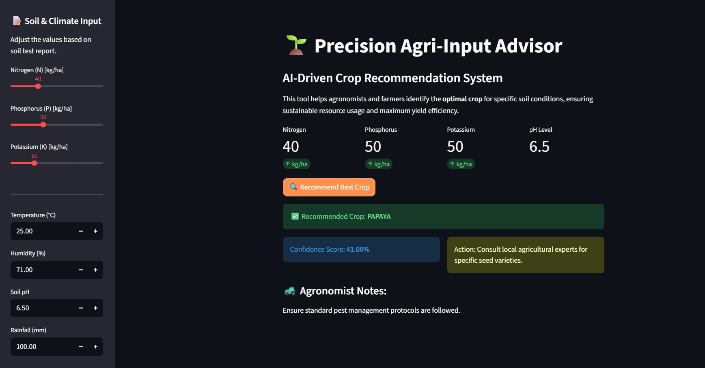

# 🌾 **Precision Agri-Advisor — AI-Driven Crop Recommendation System**

<p align="center">
  
</p>

---

## 🚀 **Live Web Application**

<p align="center">
  <a href="https://ml-application-for-precision-agri-advisor-eh7x2avadcdqxh365cf7.streamlit.app/" target="_blank">
    
  </a>
</p>

---

# 🧠 **Project Overview**

**Precision Agri-Advisor** is an AI-powered system built to help farmers and agronomists identify the **best crop** based on soil nutrients and weather conditions.
Using ML-driven insights, the system boosts yield, preserves soil health, and supports sustainable farming.

💡 **Accuracy:** 99%
🌱 **Crops Covered:** 22
🎛 **Real-Time Predictions:** Yes
🌐 **Web App:** Built & deployed using **Streamlit**

---

# 🛠 **Tech Stack**

<p align="left">
  <!-- Python -->
  
  <!-- Pandas -->
  
  <!-- NumPy -->
  
  <!-- Scikit-Learn -->
  
  <!-- Matplotlib -->
  
  <!-- Seaborn -->
  
  <!-- Streamlit -->
  <a href="https://ml-application-for-precision-agri-advisor-eh7x2avadcdqxh365cf7.streamlit.app/" target="_blank">
    
  </a>
  <!-- GitHub -->
  
  <!-- VS Code -->
  
</p>

---

# 📂 **Dataset Summary**

* **Source:** Kaggle – Crop Recommendation Dataset
* **Records:** 2,200
* **Crops:** 22
* **Features:**

  * Nitrogen (N)
  * Phosphorus (P)
  * Potassium (K)
  * Temperature
  * Humidity
  * pH
  * Rainfall

✔ No missing values
✔ Clean and structured
✔ All features numeric

---

# 🧪 **Exploratory Data Analysis**

* Identified skewed distributions (Rainfall, Potassium)
* Visualized trends using **Seaborn** & **Matplotlib**
* Analyzed nutrient relationships and weather cycles
* Correlation heatmap revealed strong nutrient–crop dependencies

---

# ⚙️ **Feature Engineering**

### 🌱 Domain-Driven Features

* `Total_Nutrients = N + P + K`
* `N_ratio = N / Total_Nutrients`
* `P_ratio = P / Total_Nutrients`
* `K_ratio = K / Total_Nutrients`

These features encode **agronomic balance**, helping the model understand crop nutrient proportions.

### 🔧 Preprocessing Pipeline

* **Label Encoding** for target classes
* **Yeo-Johnson Power Transformation**
* **Standard Scaler** for balanced feature influence

---

# 🤖 **Model Development**

### 🏆 Models Tested

| Model             | Accuracy  | Result     |
| ----------------- | --------- | ---------- |
| Decision Tree     | ~96%      | Baseline   |
| Gradient Boosting | 98.9%     | Strong     |
| **Random Forest** | **99.3%** | ⭐ Selected |

### 🎯 Why Random Forest?

* Handles non-linearity
* Reduces overfitting
* Superior generalization
* Fast prediction time

---

# 🚀 **Deployment Architecture**

| Layer         | Technology                |
| ------------- | ------------------------- |
| Programming   | Python 3.10+              |
| ML Framework  | Scikit-Learn              |
| Data          | Pandas, NumPy             |
| Visualization | Seaborn, Matplotlib       |
| UI            | Streamlit                 |
| Packaging     | joblib                    |
| Hosting       | Streamlit Community Cloud |

### 🔥 Streamlit Features

* Slider-based inputs
* Clean, minimal UI
* Real-time predictions
* Agronomist advisory text

---

# 📊 **Results & Business Impact**

* ✔ **99% prediction accuracy**
* ✔ Helps farmers choose the right crop for their soil
* ✔ Reduces fertilizer misuse
* ✔ Increases productivity & protects soil health
* ✔ Supports sustainable farming goals
* ✔ Field officers can use the system with zero technical training

---

# 🧪 **Run This Project Locally**

```bash
# Clone the repository
git clone <your-github-repo-link>

# Navigate
cd Precision-Agri-Advisor

# Install dependencies
pip install -r requirements.txt

# Launch Streamlit App
streamlit run app.py
```

---

# 🔗 **Useful Links**

### ▶️ **Live Web App**

Click the Streamlit logo 👇

<p align="left">
  <a href="https://ml-application-for-precision-agri-advisor-eh7x2avadcdqxh365cf7.streamlit.app/" target="_blank">
    
  </a>
</p>

### 🗂 GitHub Repository

👉 *(https://github.com/BiswaSudipta/ML-Application-for-Precision-Agri-Advisor)*

---

# 🌐 **My Kaggle Profile**

You can see my other projects on Kaggle:

<div align="left">

[](https://www.kaggle.com/code/sudiptbiswas1)

</div>

---

# 🔗 **Connect With Me**

<div align="left">

[](https://www.linkedin.com/in/sudipta-biswas-298915271/)

</div>

Thank You!
